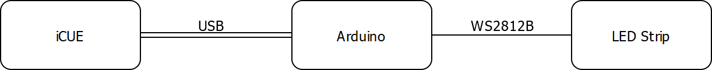

Add Support of the Lighting Node PRO Protocol to Arduino.
Controll LEDs connected to the Arduino with the Corsair Link or the iCUE Software.

# Requirements
This library uses the USB HID interface of the Arduino Micro or Leonardo.
The library is compatible with all boards using the MCU ATmega32U4.

You need two USB devices one for the "Lighting Node PRO" and one "Lighting Loader".

Visual Studio with the extension [Visual Micro](https://marketplace.visualstudio.com/items?itemName=VisualMicro.ArduinoIDEforVisualStudio).

## How it works
In the board.txt the unique VID and PID of a "Lighting Node PRO" are defined. After uploading a sketch with the library and these IDs, iCUE recognizes the Arduino as a Lighting Node PRO.
In iCUE you can then select the "Lighting Node PRO" and set some lighting effects.
iCUE sends these via the CorsairLightingProtocol to the Arduino.
These commands are understood by the library and converted into lighting effects on the RGB strips connected to the Arduino.

# DISCLAIMERS
This is a DO IT YOURSELF project, use at your own risk.

# Credits
- [HoodLoader2](https://github.com/NicoHood/HoodLoader2)
- [Arduino HID Project](https://github.com/NicoHood/HID)
- [Protocol Information](https://github.com/audiohacked/OpenCorsairLink/issues/70)
