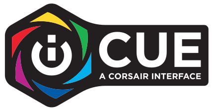
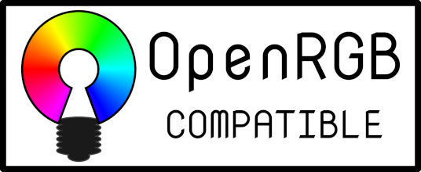
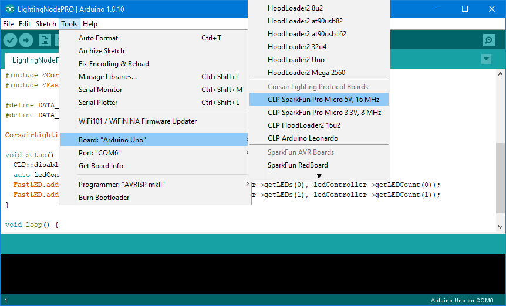
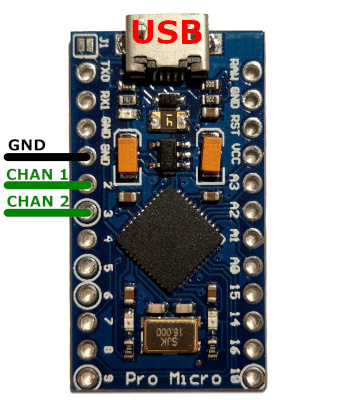
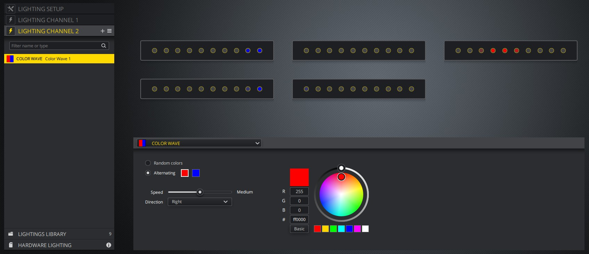

# Corsair Lighting Protocol [](https://www.ardu-badge.com/Corsair%20Lighting%20Protocol) [](https://github.com/Legion2/CorsairLightingProtocol/actions?query=workflow%3ATest+branch%3Adev+event%3Apush) [](https://isitmaintained.com/project/Legion2/CorsairLightingProtocol "Average time to resolve an issue")

<a href="https://www.corsair.com/icue"></a>
<a href="https://rgbsync.com/"></a>
<a href="https://gitlab.com/CalcProgrammer1/OpenRGB"></a>

**This library can be used to integrate custom/unofficial RGB strips with iCUE.**
_This is not an official corsair project._

## Features
* Add support of Corsair DIY device protocol to Arduino.
* Control LEDs with the [Corsair iCUE software](https://www.corsair.com/icue).
* [Support common LED chipsets](https://github.com/FastLED/FastLED/wiki/Overview#chipsets). (e.g. WS2812B, WS2801)
* Support [FastLED](http://fastled.io/).
* Supported platform: Arduino AVR
* Hardware Lighting mode.
* Use multiple devices at the same time.
* Repeat or scale LED channels to arbitrary size.

### Supported Devices
* Lighting Node PRO
* Commander PRO
* Lighting Node CORE
* LS100 Smart Lighting Controller
* LT100 Smart Lighting Towers


# Getting started
This project is an Arduino library called "Corsair Lighting Protocol".
It can be used to control Arduino boards with iCUE.
This project provides example sketches for easy use with Arduino IDE.

- [Requirements](#requirements)
- [Install the libraries](#install-the-libraries)
- [Create a Lighting Node PRO](#create-a-lighting-node-pro)
- [Use the Lighting Node PRO](#use-the-lighting-node-pro)

## Requirements
The library is compatible with all boards using the MCU ATmega32U4.
This includes **Arduino Leonardo**, **SparkFun Pro Micro**, **Arduino Micro**, and **Adafruit 32u4 AVR Boards**.
It also supports the Arduino Uno and Arduino Mega, **but** this requires the [HoodLoader2](https://github.com/NicoHood/HoodLoader2) bootloader, see [this wiki](https://github.com/Legion2/CorsairLightingProtocol/wiki/How-to-use-on-Arduino-Uno-and-Arduino-Mega) for more details.
It is **not** compatible with ATmega328 (Arduino Nano), STM8S103F3, teensy, ESP8266 and ESP32 see [list of architecture/platform](https://github.com/Legion2/CorsairLightingProtocol/issues?q=is%3Aissue+label%3Aarchitecture%2Fplatform) for a detailed description why they are not supported.
In the rest of the documentation "Arduino" is used as a synonym for all supported boards regardless of the manufacturer.

When you have problems with a board not listed here, please open an [Issue](https://github.com/Legion2/CorsairLightingProtocol/issues).

## Install the libraries
To use this library you must install it with the Library-Manager.
Open the Library-Manager in Arduino IDE via Tools->Manage Libraries...
Search for "Corsair Lighting Protocol" and install the Corsair Lighting Protocol library.
This library also requires the [FastLED](http://fastled.io/) library.
Search for "FastLED" in the Library-Manager and install the FastLED library.

## Create a Lighting Node PRO
This guide will teach you how to create a Lighting Node PRO with an Arduino Leonardo compatible board.
If you have an Arduino Uno or Mega, see the [other guide](https://github.com/Legion2/CorsairLightingProtocol/wiki/How-to-use-on-Arduino-Uno-and-Arduino-Mega).

1. Open the example "LightingNodePRO", you can find it in Arduino IDE in the File menu->Examples->Corsair Lighting Protocol->LightingNodePRO.
   If you can't open the LightingNodePRO example the Corsair Lighting Protocol library is not installed correctly.

   
1. Install the [CLP Boards](https://github.com/Legion2/CorsairLightingProtocolBoards).
   They can be installed by following the [CLP Boards installation guide](https://github.com/Legion2/CorsairLightingProtocolBoards#how-to-use-these-boards-in-arduino).
   After installation it should be possible to select the CLP Boards in the Arduino IDE as shown in the screenshot below.
   If your are using a Sparkfun Pro Micro also install the [SparkFun Boards definition](https://github.com/sparkfun/Arduino_Boards#installation-instructions).

   
1. Upload the "LightingNodePRO" sketch to your Arduino.

   
1. Do the wiring.
   For more information on [how to wire the leds](https://github.com/FastLED/FastLED/wiki/Wiring-leds) and [how to set up the LEDs in the code](https://github.com/FastLED/FastLED/wiki/Basic-usage#setting-up-the-leds) see the links.
   
   
1. Verify your device works as expected.
   Open the Windows settings->devices->Other devices.
   Somewhere in the list of devices, there should be a device called "Lighting Node PRO".
1. Now open [iCUE](https://www.corsair.com/icue) there you should see the "Lighting Node PRO".

> If you have any problem during setup you may find the solution in the [Troubleshooting section](https://github.com/Legion2/CorsairLightingProtocol/wiki/Troubleshooting).

## Use the Lighting Node PRO



In iCUE open the "Lighting Setup" tab of the Lighting Node PRO(LNP) and set for both Lighting Channels the device to "RGB Light Strip" and the amount to a tenth of the LEDs you have.
iCUE groups the LEDs into groups of ten.
So if you have 20 LEDs, set the amount to 2.
Now you can create lighting effects in the "Lighting Channel #" tabs.

# Documentation

- [API Documentation](https://legion2.github.io/CorsairLightingProtocol/)
- [How it works](#how-it-works)
- [Use of multiple devices](#use-of-multiple-devices)
- [Repeat or scale LED channels](#repeat-or-scale-led-channels)
- [Increase the Brightness of the LEDs](#increase-the-brightness-of-the-leds)
- [Hardware Lighting mode](#hardware-lighting-mode)

## How it works
This library uses the USB HID interface of the ATmega32U4.
After uploading a sketch with the library and selected CLP Boards, iCUE recognizes the Arduino as a Corsair device, because the CLP Boards use USB IDs of Corsair.
In iCUE you can then select the device and set some lighting effects.
iCUE sends these via the HID protocol to the Arduino.
These commands are understood by the library and converted into lighting effects on the RGB strips connected to the Arduino.
The [FastLED](http://fastled.io/) library is used to control the LEDs.

## Use of multiple devices
Each device has two unique IDs, that is, they should be unique.
You must give each device a unique ID.
There are two IDs that must be changed `Serial Number` and `DeviceID`.

The Serial Number can be set in the constructor of `CorsairLightingProtocolHID` and `CLPUSBSerialBridge` as shown in the [example](examples/AdditionalFeatures/AdditionalFeatures.ino).
```C++
const char mySerialNumber[] PROGMEM = "202B6949A967";
CorsairLightingProtocolHID cHID(&cLP, mySerialNumber);
```
The Serial Number MAY only consist of HEX characters (0-9 and A-F).

The DeviceID can be set with the `setDeviceID` function of `CorsairLightingFirmware`.
```C++
void setup() {
    byte deviceId[4] = { 0x9A, 0xDA, 0xA7, 0x8E };
    firmware.setDeviceID(deviceId);
    ...
}
```

### Alternative
The `DeviceID` can be changed with the [DeviceIDTool](examples/DeviceIDTool/DeviceIDTool.ino).
Upload the DeviceIDTool sketch and then open the Serial monitor with baudrate 115200.
The tool displays the current DeviceID, you can type in a new DeviceID that is saved on the Arduino.
After that, you can upload another sketch.

## Repeat or scale LED channels
You can repeat or scale LED channel controlled by iCUE onto physical LED strips.
This is very useful if you have very long LED strips that are longer than 60/96/135 LEDs, which is the maximum number iCUE supports.

To repeat or scale a LED channel you must apply the `CLP::repeat` or the `CLP:scale` function in the update hook of the FastLEDController.
See the [RepeatAndScale](examples/RepeatAndScale/RepeatAndScale.ino) example for the complete code.
Both functions take the FastLEDController pointer and the channel index as arguments.
Additionally, the `repeat` function takes as an argument how often the LED channel should be repeated.
For example, if you want to duplicate the channel you must pass `2` as argument.
The `scale` function takes as third argument the length of the physical LED strip to which it scales the channel using integer scaling.
For example you have 144 physical LEDs on you strip and 60 on the LED channel.
Then the third argument of the `scale` function is `144`.

For both functions it's **important**, that the CRGB arrays have at least the length of the physical LED strip.
This means if your LED channel from iCUE has 50 LEDs and you use the `repeat` function to control 100 physical LEDs you MUST declare the CRGB array at least with a length of 100.

## Increase the Brightness of the LEDs
When using LS100 or LT100 iCUE only uses 50% of the LEDs brightness even if you set the brightness to max in the iCUE Device Settings.
But there are good news, we can increase the brightness with the Arduino so we can use the full brightness of our LEDs.
Add the `CLP::fixIcueBrightness` function to the `onUpdateHook` in the setup function as shown in the [example](examples/AmbientBacklight/AmbientBacklight.ino).
If there are multiple functions called in `onUpdateHook`, `fixIcueBrightness` should be the first.
Only use this function with LS100 and LT100 devices!
```C++
ledController.onUpdateHook(0, []() {
	CLP::fixIcueBrightness(&ledController, 0);
});
```

## Reverse direction of LED Strip
If you want to change the direction of the LEDs of the Strip without physically change the strip, the `CLP::reverse` function can be used.
The reverse function must be called be for scaling.
```C++
ledController.onUpdateHook(0, []() {
	CLP::reverse(&ledController, 0);
});
```
## Hardware Lighting mode
The [Hardware Lighting mode](https://forum.corsair.com/v3/showthread.php?t=182874) can be configured in iCUE.
It allows you the set lighting effects that will be active when iCUE **is not** running.
This is the case when the PC is off, in sleep mode, booting or the user is logged out.
So if you want to have lighing effects in all these situations, use the Hardware Lighting mode.
If you don't want it, configure a static black color.

# License
This project is licensed under the Apache 2.0 License.

# DISCLAIMERS
This is a DO IT YOURSELF project, use at your own risk!

# Credits
- [HoodLoader2](https://github.com/NicoHood/HoodLoader2)
- [Arduino HID Project](https://github.com/NicoHood/HID)
- [Protocol Information](https://github.com/audiohacked/OpenCorsairLink/issues/70)

## Related projects
- [CorsairArduinoController](https://github.com/TylerSeiford/CorsairArduinoController)
- [CorsairLightingProtocolBoards](https://github.com/Legion2/CorsairLightingProtocolBoards)
- [OpenCorsairLighting](https://github.com/McHauge/OpenCorsairLighting)
