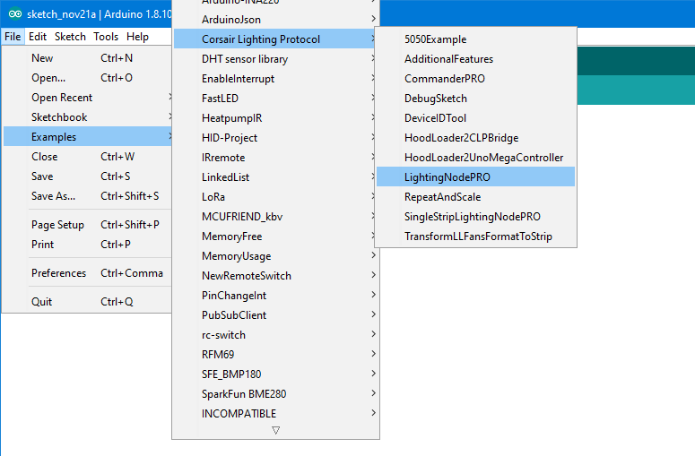

[](https://www.ardu-badge.com/Corsair%20Lighting%20Protocol)


**This library can be used to integrate custom/unofficial RGB strips with iCUE.**

## Features
* Add support of the Lighting Node PRO protocol to Arduino.
* Control LEDs with the Corsair Link or the iCUE software.
* Easy to use with [FastLED](http://fastled.io/).
* [Supported LED chipsets](https://github.com/FastLED/FastLED/wiki/Overview#chipsets).
* Persistent settings for use without a USB connection.
* Use multiple devices at the same time.
* Repeat or scale LED channels to arbitrary size.

### Supported Devices
* Lighting Node PRO
* Commander PRO
* Lighting Node CORE
* Smart Lighting Controller (LS100)


# Getting started

- [Requirements](#requirements)
- [Install the library](#install-the-library)
- [Create a Lighting Node PRO](#create-a-lighting-node-pro)
- [Use the Lighting Node PRO](#use-the-lighting-node-pro)

## Requirements
The library is compatible with all boards using the MCU ATmega32U4.
This includes **Arduino Leonardo**, **SparkFun Pro Micro**, and **Arduino Micro**.
It also supports the Arduino Uno and Arduino Mega, **but** this requires the [HoodLoader2](https://github.com/NicoHood/HoodLoader2) bootloader, see [this wiki](https://github.com/Legion2/CorsairLightingProtocol/wiki/How-to-use-on-Arduino-Uno-and-Arduino-Mega) for more details.
It is **not** compatible with Arduino Nano.
In the rest of the documentation "Arduino" is used as a synonym for all supported boards regardless of the manufacturer.

You have problems with a board not listed here, please open an [Issue](https://github.com/Legion2/CorsairLightingProtocol/issues).

## Install the library
Use the [Library-Manager](https://www.ardu-badge.com/Corsair%20Lighting%20Protocol/ide) to install this library (Corsair Lighting Protocol).
Additionally, the [FastLED](http://fastled.io/) library must be installed.

## Create a Lighting Node PRO
This guide will teach you how to create a Lighting Node PRO with an Arduino Leonardo compatible board.
If you have an Arduino Uno or Mega, see the [other guide](https://github.com/Legion2/CorsairLightingProtocol/wiki/How-to-use-on-Arduino-Uno-and-Arduino-Mega).

1. Open the example "LightingNodePRO", you can find it in Arduino IDE in the File menu->Examples->Corsair Lighting Protocol->LightingNodePRO or in the [examples directory](examples) if you download this project.

   
1. Follow [these steps](https://github.com/Legion2/CorsairLightingProtocolBoards#how-to-use-these-boards-in-arduino) to install the CLP Boards and upload the sketch to your Arduino.
1. Do the wiring.
   For more information on [how to wire the leds](https://github.com/FastLED/FastLED/wiki/Wiring-leds) and [how to set up the LEDs in the code](https://github.com/FastLED/FastLED/wiki/Basic-usage#setting-up-the-leds) see the links.
   
   
1. Verify that your device works as expected.
   Open the Windows settings->devices->Other devices.
   Somewhere in the list of devices, there should be a device called "Lighting Node PRO".
1. Now open [iCUE](https://www.corsair.com/icue) there should be the "Lighting Node PRO".

## Use the Lighting Node PRO


In iCUE open the "Lighting Setup" tab of the Lighting Node PRO(LNP) and set for both Lighting Channels the device to "RGB Light Strip" and the amount to a tenth of the LEDs you have.
iCUE groups the LEDs into groups of ten.
So if you have 20 LEDs, set the amount to 2.
Now you can create lighting effects in the "Lighting Channel #" tabs.

# Misc

- [API Documentation](https://legion2.github.io/CorsairLightingProtocol/)
- [How it works](#how-it-works)
- [Use multiple Devices](#use-multiple-devices)
- [Repeat or scale LED channel](#repeat-or-scale-led-channel)

## How it works
This library uses the USB HID interface of the Arduino Micro or Leonardo.
In the board.txt the unique VID and PID of a "Lighting Node PRO" are defined.
After uploading a sketch with the library and these IDs, iCUE recognizes the Arduino as a Lighting Node PRO.
In iCUE you can then select the "Lighting Node PRO" and set some lighting effects.
iCUE sends these via the CorsairLightingProtocol to the Arduino.
These commands are understood by the library and converted into lighting effects on the RGB strips connected to the Arduino.
The [FastLED](http://fastled.io/) library is used to control the LEDs.

## Use multiple Devices
Each device has two unique IDs, that is, they should be unique.
You must give each device a unique ID.
There are two IDs that must be changed `Serial Number` and `DeviceID`.

The Serial Number can be set in the constructor of `CorsairLightingProtocolHID` and `CLPUSBSerialBridge` as shown in the [example](examples/AdditionalFeatures/AdditionalFeatures.ino).
```C++
const char mySerialNumber[] PROGMEM = "202B6949A967";
CorsairLightingProtocolHID cHID(&cLP, mySerialNumber);
```
The Serial Number MAY only consist of HEX characters (0-9 and A-F).

The DeviceID can be set with the `setDeviceID` function of `CorsairLightingFirmware`.
```C++
void setup() {
    byte deviceId[4] = { 0x9A, 0xDA, 0xA7, 0x8E };
    firmware.setDeviceID(deviceId);
    ...
}
```

### Alternative
The `DeviceID` can be changed with the [DeviceIDTool](examples/DeviceIDTool/DeviceIDTool.ino).
Upload the DeviceIDTool sketch and then open the Serial monitor with baudrate 115200.
The tool displays the current DeviceID, you can type in a new DeviceID that is saved on the Arduino.
After that, you can upload another sketch.

## Repeat or scale LED channel
You can repeat or scale LED channel controlled by iCUE onto physical LED strips.
This is very useful if you have very long LED strips that are longer than 60/96/135 LEDs.
This is the maximum number iCUE supports.

To repeat or scale a LED channel you must apply the `CLP::repeat` or the `CLP:scale` function in the update hook of the FastLEDController.
The functions must be included from `FastLEDControllerUtils.h`.
See the [RepeatAndScale](examples/RepeatAndScale/RepeatAndScale.ino) example for the complete code.
Both functions take the FastLEDController pointer and the channel index as arguments.
Additionally, the `repeat` function takes as an argument how often the LED channel should be repeated.
For example, if you want to duplicate the channel you must pass `2` as argument.
The `scale` function takes as third argument the length of the physical LED strip to which it scales the channel using integer scaling.
For example you have 144 physical LEDs on you strip and 60 on the LED channel.
Then the third argument of the `scale` function is `144`.

For both functions it's **important**, that the CRGB arrays have at least the length of the physical LED strip.
This means if your LED channel from iCUE has 50 LEDs and you use the `repeat` function to control 100 physical LEDs you MUST declare the CRGB array at least with a length of 100.

# DISCLAIMERS
This is a DO IT YOURSELF project, use at your own risk!

# Credits
- [HoodLoader2](https://github.com/NicoHood/HoodLoader2)
- [Arduino HID Project](https://github.com/NicoHood/HID)
- [Protocol Information](https://github.com/audiohacked/OpenCorsairLink/issues/70)

## Related projects
- [CorsairArduinoController](https://github.com/TylerSeiford/CorsairArduinoController)
- [CorsairLightingProtocolBoards](https://github.com/Legion2/CorsairLightingProtocolBoards)
- [OpenCorsairLighting](https://github.com/McHauge/OpenCorsairLighting)
